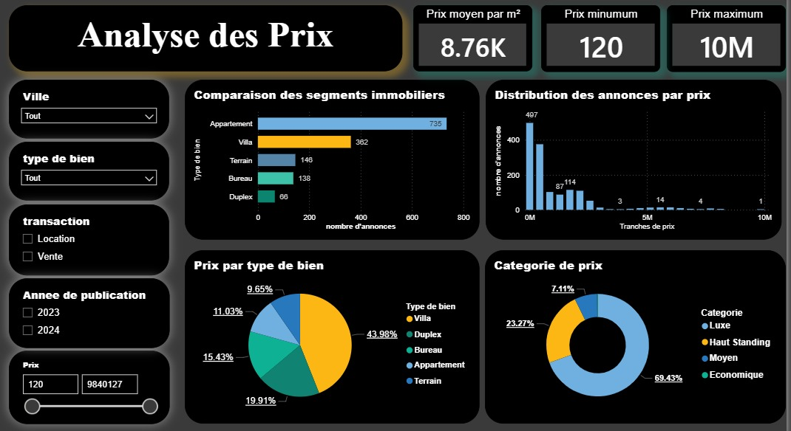
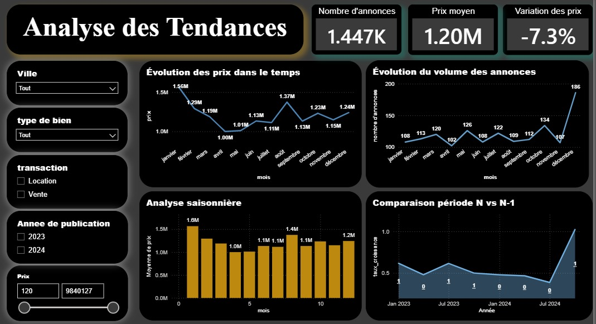

# Darkom Real Estate Analytics Pipeline

An end-to-end data engineering pipeline that collects, cleans, enriches, and warehouses Moroccan real estate listing data from **Darkom** — and delivers it through a **Power BI dashboard** for business intelligence reporting.

---

## Overview

The pipeline processes **1,508 real estate listings** across **10 Moroccan cities**, automating the full data lifecycle:

```
Raw CSV  ->  Staging (PostgreSQL)  ->  Cleaning  ->  Feature Engineering  ->  BI Schema  ->  Power BI Dashboard
```

All stages are orchestrated by a single `main.py` entry point, with each step independently logged.

---

## Project Structure

```
DARKOM_ANNONCES/
│
├── requirements.txt                            # Python dependencies
├── .gitignore
├── .env
│
├── data/
│   ├── raw/
│   │   └── darkom_annonces.csv                 # Raw source data (1,508 listings)
│   └── processed/
│       ├── cleaned_data.csv                    # Output of cleaning step
│       └── cleaned_feature_eng_data.csv        # Output of feature engineering step
│
├── logs/
│   ├── bi_schema.log
│   ├── cleaning.log
│   ├── feature_eng.log
│   ├── main.log
│   └── staging_schema.log
│
├── reports/
│   ├── power_bi/
│   │   └── darkom.pbix                         # Power BI report file
│   └── screenshots/
│       ├── report_1.jpeg
│       ├── report_2.jpeg
│       ├── report_3.jpeg
│       └── report_4.jpeg                       # Dashboard screenshots (4 pages)
│
├── src/
│   ├── main.py                                 # Pipeline orchestrator
│   ├── clean/
│   │   └── cleaning.py                         # 4-step cleaning pipeline
│   ├── feature_engineering/
│   │   └── feature_engineering.py              # Derived feature computation
│   └── warehouse/
│       ├── bi_schema.py                        # Builds star-schema BI tables
│       └── staging_schema.py                   # Loads raw data into PostgreSQL staging
│
└── tests/
    └── tests.ipynb                             # Exploratory / unit tests notebook
```

---

## Source Data

| Attribute | Detail |
|---|---|
| **Source** | Darkom.ma (Moroccan real estate classifieds) |
| **Listings** | 1,508 annonces |
| **Cities** | Casablanca, Rabat, Marrakech, Tanger, Agadir, Fes, Meknes, Tetouan, Kenitra, Oujda |
| **Property types** | Appartement, Villa, Terrain, Bureau, Duplex |
| **Transactions** | Vente (1,048) · Location (422) |

**Raw columns:** `annonce_id`, `date_publication`, `titre`, `ville`, `quartier`, `type_bien`, `transaction`, `prix`, `surface`, `nb_chambres`, `nb_salles_bain`, `etage`, `annee_construction`

---

## Pipeline Stages

### 1. Staging — `warehouse/staging_schema.py`

- Creates a `staging` schema in PostgreSQL if it doesn't exist
- Creates the `staging.darkom_annonces` table
- Truncates and reloads from the raw CSV on every run (idempotent)
- Drops duplicate `annonce_id` values before loading

### 2. Cleaning — `clean/cleaning.py`

Four sequential steps:

**Step 1 — Text normalisation**
- Standardises city names (e.g. `"casa"` -> `"Casablanca"`, `"fès"` -> `"Fes"`)

**Step 2 — Data type conversion**
- Parses `date_publication` as `datetime`
- Converts `prix`, `nb_chambres`, `nb_salles_bain`, `etage`, `annee_construction` to nullable `Int64`
- Casts `type_bien` and `transaction` to `category` dtype

**Step 3 — Missing value imputation**
- `date_publication` (~5% missing): forward/back filled after sorting
- `quartier` (~27% missing): filled with the mode per city
- `type_bien` (~2.5% missing): extracted from the listing title using keyword matching
- `transaction` (~2.5% missing): inferred from price (<=30,000 -> Location, else Vente)
- `nb_chambres`, `nb_salles_bain`, `etage` (~8–15% missing): filled with 0 for Terrain, else group median by `type_bien`
- `annee_construction` (~13.5% missing): filled with median grouped by city + property type

**Step 4 — Outlier removal**
- IQR-based outlier detection on `prix`, `surface`, `nb_chambres`, `nb_salles_bain`
- Hard filters applied: `surface >= 30 m²`, `nb_chambres <= 10`, `nb_salles_bain <= 6`, `prix <= 20,000,000 MAD`

### 3. Feature Engineering — `Feature_Engineering/feature_eng.py`

New columns derived from clean data:

| Feature | Description |
|---|---|
| `prix_m2` | Price per square metre (`prix / surface`) |
| `age_bien` | Estimated property age (`current_year - annee_construction`) |
| `categorie_prix` | Price tier: Economique / Moyen / Haut Standing / Luxe |
| `categorie_surface` | Size tier: Petit (<80 m²) / Moyen (80–150 m²) / Grand (>150 m²) |
| `annee_publication` | Year extracted from `date_publication` |
| `mois_publication` | Month extracted from `date_publication` |
| `trimestre_publication` | Quarter extracted from `date_publication` |

### 4. BI Schema — `warehouse/bi_schema.py`

Builds a **star schema** in PostgreSQL (`bi_schema`):

```
                    ┌──────────────┐
                    │  dim_date    │
                    │  date_id PK  │
                    └──────┬───────┘
                           │
┌─────────────────┐   ┌────▼──────────────┐   ┌───────────────────┐
│  dim_location   │   │  fact_annonces    │   │  dim_bien         │
│  location_id PK ├───│  annonce_id PK    ├───│  bien_id PK       │
│  ville          │   │  prix             │   │  type_bien        │
│  quartier       │   │  surface          │   │  categorie_surface│
└─────────────────┘   │  prix_m2          │   └───────────────────┘
                      │   nb_chambres     │
┌─────────────────┐   │  nb_salles_bain   │
│  dim_transaction│   │  etage            │
│  transaction_id ├───│  age_bien         │
│  transaction    │   │  date_id FK       │
│  categorie_prix │   │  location_id FK   │
└─────────────────┘   │  bien_id FK       │
                      │  transaction_id FK│
                      └───────────────────┘
```

### 5. Dashboard — Power BI

The `.pbix` file connects to the BI schema and provides 4 report pages.

---

## Dashboard Screenshots

**Report 1**


**Report 2**


**Report 3**


**Report 4**


---

## Getting Started

### Prerequisites

- Python 3.9+
- PostgreSQL (local or remote)
- Power BI Desktop (for the dashboard)

### Installation

```bash
git clone https://github.com/ayoub-data-analyst/darkom_real_estate_analytics_pipeline.git
cd darkom_real_estate_analytics_pipeline
pip install -r requirements.txt
```

### Environment Variables

Create a `.env` file in the project root:

```env
DB_HOST=your_host
DB_PORT=your_port
DB_NAME=your_db_name
DB_USER=your_user
DB_PASSWORD=your_password
```

### Create the logs directory

```bash
mkdir logs
```

### Run the Pipeline

```bash
python main.py
```

The pipeline runs all four stages in sequence and prints progress to stdout. Each stage writes its own log file:

| Stage | Log file |
|---|---|
| Staging | `logs/staging_schema.log` |
| Cleaning | `logs/cleaning.log` |
| Feature Engineering | `logs/feature_eng.log` |
| BI Schema | `logs/bi_schema.log` |
| Pipeline (global) | `logs/main.log` |

---

## Key Dependencies

| Library | Purpose |
|---|---|
| `pandas` | Data manipulation across all stages |
| `SQLAlchemy` | PostgreSQL ORM & connection management |
| `psycopg2-binary` | PostgreSQL driver |
| `python-dotenv` | Loads DB credentials from `.env` |
| `numpy` | Numerical operations |

See `requirements.txt` for the full pinned list.

---

## Testing

Exploratory and unit tests are in `test/test.ipynb`. Open it with Jupyter:

```bash
jupyter notebook test/test.ipynb
```

---

## Author

**Ayoub** — [@ayoub-data-analyst](https://github.com/ayoub-data-analyst)
